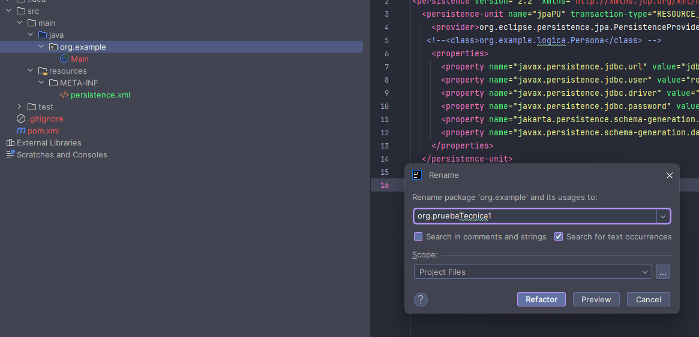
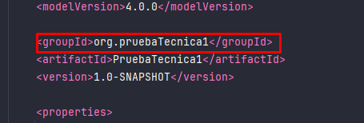
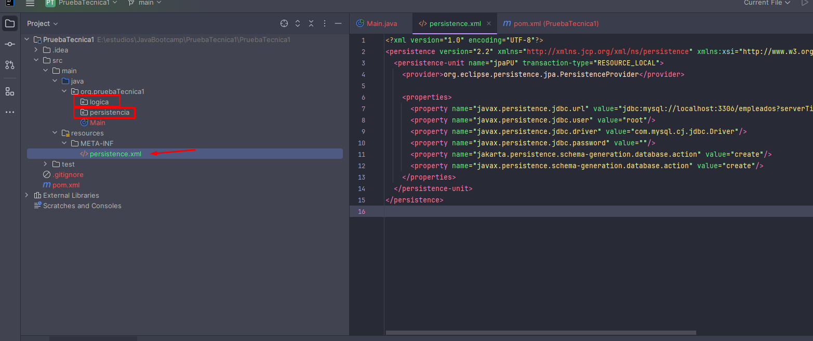
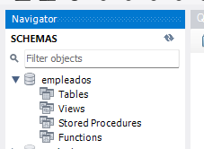
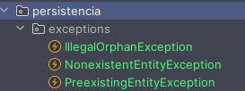
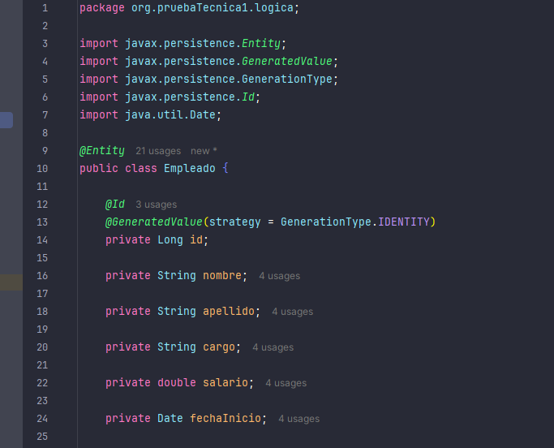
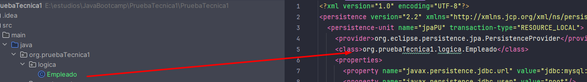
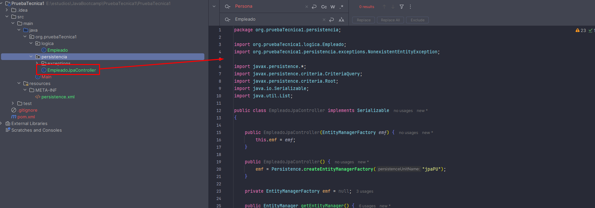

# RodriguezLaura_pruebatec1
Prueba tecnica Java Basico HACKABOSS bootcamp por Laura Rodriguez Contador

## 🚀 Primeros pasos 

Creacion de Proyecto Maven en IntelliJ , donde primero he cambiado el nombre por defecto de la carpeta principal del proyecto por `"pruebaTecnica1"`





Es importante tener en cuenta que en el archivo `pom.xml` debemos añadir las dependencias de JPA y MySQL, para ello añadimos las siguientes dependencias:


Tras esto, creamos una serie de paquetes en el proyecto, que serán los siguientes: `logica` y `persistencia`

Además de esto añadiremos la carpeta META-INF een resources y dentro de esta carpeta añadiremos el archivo `persistence.xml` que será el archivo de configuración de la base de datos.





Para la realización de los objetivos de la actividad debemos empezar creando una base de datos en mysql llamado : empleados


```sql
create database empleados;
```



Una vez creada la base de datos, debemos configurar en el archivo persistence.xml la conexión a la base de datos, en mi caso la conexión es la siguiente:

```xml
 <properties>
      <property name="javax.persistence.jdbc.url" value="jdbc:mysql://localhost:3306/empleados?serverTimezone=UTC"/>
      <property name="javax.persistence.jdbc.user" value="root"/>
      <property name="javax.persistence.jdbc.driver" value="com.mysql.cj.jdbc.Driver"/>
      <property name="javax.persistence.jdbc.password" value=""/>
      <property name="jakarta.persistence.schema-generation.database.action" value="create"/>
      <property name="javax.persistence.schema-generation.database.action" value="create"/>
    </properties> 
```


Por ultimo vamos a añadir a la carpeta `persistencia` la carpeta aportada por el profesor llamada `exceptions` que contiene las clases IllegalOrphanException, NonexistentEntityException y PreexistingEntityException que nos ayudarán a gestionar las excepciones en la base de datos.




## ⚒️ Creando la clase Empleado

Dentro del paquete `logica` creamos la clase `Empleado` que será la clase que representará a los empleados de la empresa. Haciendo esta clase JPA creará una tabla en la base de datos con los atributos de la clase.
Es importante usar correctamente las anotaciones de JPA que nos ha enseñado el profesor en clase.
Es tambien importante marcar el atributo `id` como clave primaria y autoincremental, asi como crear un constructor vacio y un constructor con todos los atributos menos el id , todos sus getters y setters.



Tras terminar con la clase Empleado debemos añadir en el archivo `persistence.xml` la clase Empleado para que JPA la reconozca y cree la tabla en la base de datos si no existe.




## 👩‍💻 Creando la clase EmpleadoJpaController 

Esta clase será la encargada de realizar las operaciones CRUD en la base de datos, para ello debemos crear una serie de métodos que nos permitan realizar estas operaciones. Es basicamente una clase DAO que la creare en el paquete `persistencia`.

En clase el profesor nos a proporcionado clases ejemplo de como deberia ser esta clase, por lo que la creare siguiendo el ejemplo del profesor.
A pesar de no indagar mucho en el funcionamiento de esta clase, he intentado entenderla y adaptarla a mi proyecto.





## 📡 Creando la clase ControladoraPersistencia

Esta clase será la encargada de gestionar las operaciones CRUD en la base de datos, para ello debemos crear una serie de métodos que nos permitan realizar estas operaciones. Es basicamente una clase que se encargará de llamar a los métodos de la clase `EmpleadoJpaController`.

Lo primero que haremos será crear un objeto de la clase `EmpleadoJpaController` y en el constructor de la clase inicializaremos este objeto.

Ahora podemos empezar a crear todos los metodos que nos pide la actividad :

1️⃣ Agregar un nuevo empleado:

```java
   public void createEmpleado(Empleado pers) {
        empleadoJPA.create(pers);
    }
```
2️⃣ Listar empleados:

```java
    public List<Empleado> getAllEmpleados () {
        return empleadoJPA.findEmpleadoEntities();
    }
```
3️⃣ Actualizar información de un empleado: 
    
```java
    public void updateEmpleado (Empleado pers) {
        try {
            empleadoJPA.edit(pers);
        } catch (Exception ex) {
            Logger.getLogger(ControladoraPersistencia.class.getName()).log(Level.SEVERE, null, ex);
        }
    }
```

4️⃣ Eliminar un empleado:

```java

public void deleteEmpleado(Long id) {
        try {
            empleadoJPA.destroy(id);
        } catch (NonexistentEntityException ex) {
            Logger.getLogger(ControladoraPersistencia.class.getName()).log(Level.SEVERE, null, ex);
        }
    }

```

5️⃣ Buscar empleados por cargo:

```java
     public List<Empleado> getEmpleadoByCargo(String cargo){
        List<Empleado> empleadosCargo = new ArrayList<>();
        
        for(Empleado empleado : empleadoJPA.findEmpleadoEntities()){
            if(empleado.getCargo().equalsIgnoreCase(cargo)){
                empleadosCargo.add(empleado);
            }
        }
        return empleadosCargo;
    }

```

